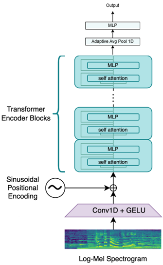
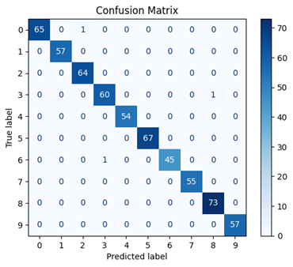
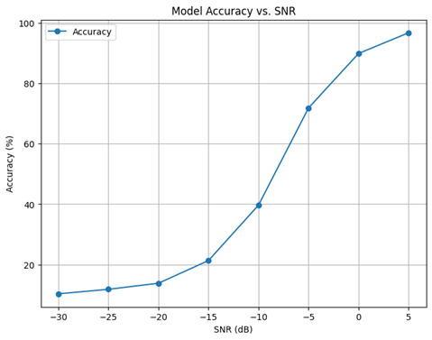

# Speech Processing – Spoken Digit Recognition Using Deep Learning

## 🔍 Overview

This project focuses on building a deep learning model for classifying spoken digits (0–9) from audio recordings. The model is designed without any recurrent components (e.g., RNN) and instead relies on modern transformer-based architectures, including **Attention** and **Positional Encoding** based on OpenAI's [Whisper](https://cdn.openai.com/papers/whisper.pdf) structure. The goal is to explore and evaluate how well such a model can learn representations of speech and generalize under noise.

  

All implementations are done in Python using **PyTorch**, and experiments include noise robustness and model evaluation under varying signal-to-noise ratios (SNR).

## 🧰 Technologies Used

- Python
- PyTorch
- TorchAudio
- Scikit-learn
- Jupyter Notebook
- Matplotlib

## 📋 Tasks and Features

- 📊 Designed a transformer-based model for digit classification using audio signals.
- 🧠 Implemented components such as Attention and Positional Encoding.
- 📈 Visualized and explained a block diagram of the model and described each component briefly.
- 🧪 Trained the model on clean data and evaluated its performance using a confusion matrix.
- 🎧 Added white noise to test samples and re-evaluated model performance.
- 🔁 Plotted performance metrics across different SNR levels to observe the model's robustness.
- 🧩 Proposed and implemented strategies to improve noise robustness and compared new results with previous evaluations.

## 🔗 Dataset

- **Free Spoken Digit Dataset (FSDD)**  
  [Link to Dataset on Kaggle](https://www.kaggle.com/datasets/joserzapata/free-spoken-digit-dataset-fsdd)

## 📄 Project Report

See the [full implementation report](./report.pdf) for architecture details, evaluation metrics, and noise robustness analysis.

## 📈 Results

The model was evaluated on both clean and noisy test samples. Noise was introduced by adding white noise at various signal-to-noise ratio (SNR) levels to assess the model’s robustness.

### 🔹 Confusion Matrix (Clean Test Data)

  

### 🔹 Accuracy vs. SNR

  

As the SNR decreases, the model’s classification accuracy gradually drops, but the decline is relatively smooth — indicating some robustness to noise. Further improvement techniques were applied and discussed in the report.

